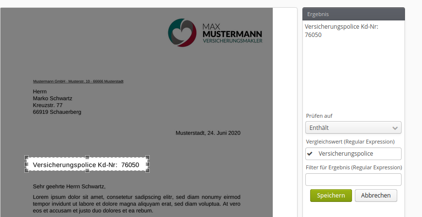

# Vorgangstrenner

Als Vorgangstrenner wird das Merkmal bezeichnet, welches die einzelnen Sendungen innerhalb eines Dokuments mit mehreren Vorgängen trennt.


Der Vorgangstrenner muss in **jeder Sendung** enthalten sein - er ist verpflichtend notwendig um eine korrekte Aufteilung der Sendungen zu ermöglichen.



**Tipp:** In vielen Fälle kann der Identifizierer als Vorgangstrenner dienen.



Der Vorgangstrenner kann auch ein [weisstext.md](../../fortgeschrittene-themen/weisstext.md "mention") sein


### Optionen

#### Vorgangstrenner auf Startseite des Vorgangs

Dies ist die Standardeinstellung - nur die erste Seite des Vorgangs wird durchsucht

#### **Vorgangstrenner bei geändertem Wert**

Der Inhalt des Vorgangstrenners wird zwischen Vorgängen verglichen.  So kann z.B. ein Vorgangstrenner inklusive einer Kundennummer definiert werden wie `Rechnung für Kunde <Kundennummer>.` Bei jeder Änderung des Textes wird automatisch ein neuer Vorgang erzeugt.


Diese Option ist **nur für erfahrene Benutzer** gedacht da sie unvorhersehbare Effekte haben kann. **Jede Änderung** des Inhaltes des Vorgangstrenners erzeugt einen neuen Vorgang (exakter Vergleich)

